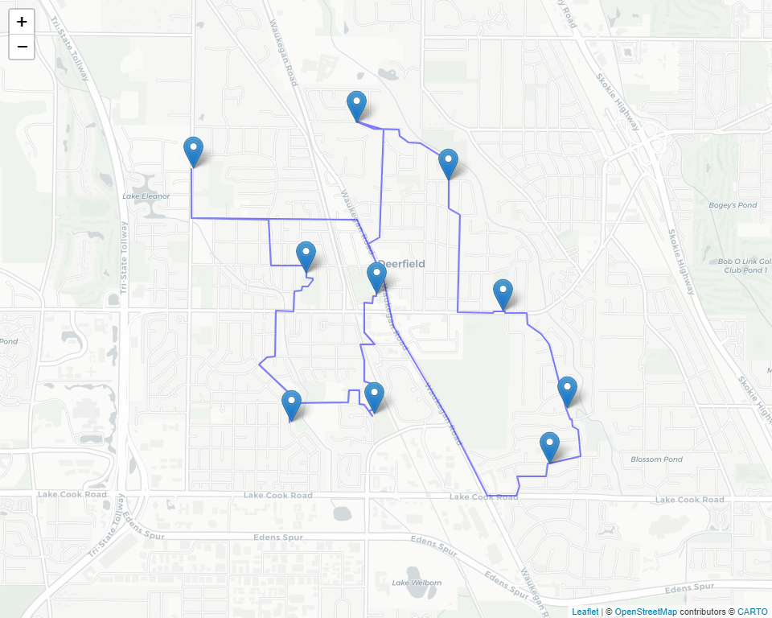
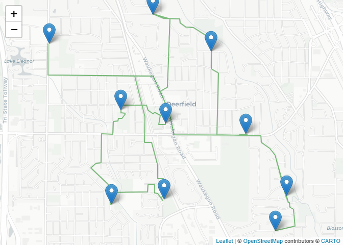
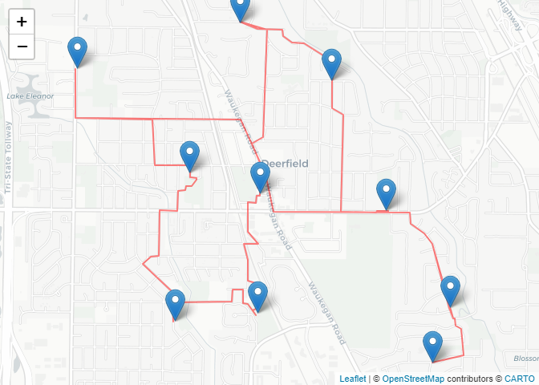
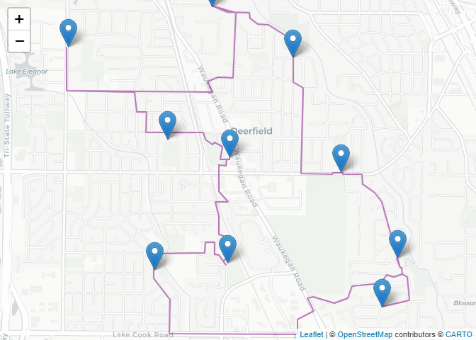
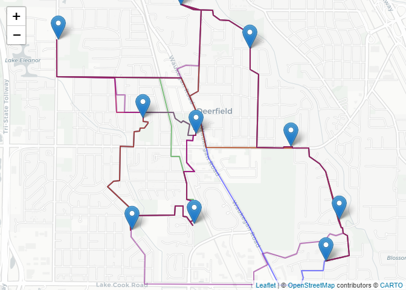

Running Route Optimization
================
Alex Brunk
2025-01-11

- [Overview](#overview)
- [Required Libraries](#required-libraries)
- [Data Preparation](#data-preparation)
  - [Geocoding and Spatial Data
    Preparation](#geocoding-and-spatial-data-preparation)
  - [Calculate Distances Between
    Locations](#calculate-distances-between-locations)
- [Route Optimization Algorithms](#route-optimization-algorithms)
  - [Helper Functions](#helper-functions)
  - [Algorithm 1: Brute Force](#algorithm-1-brute-force)
  - [Algorithm 2: Nearest Neighbor](#algorithm-2-nearest-neighbor)
  - [Algorithm 3: Two-Opt Improvement](#algorithm-3-two-opt-improvement)
  - [Algorithm 4: Simulated Annealing](#algorithm-4-simulated-annealing)
  - [Combined Visualization](#combined-visualization)
  - [Algorithm Performance
    Comparison](#algorithm-performance-comparison)
- [Key Findings and Recommendations](#key-findings-and-recommendations)
- [Conclusions](#conclusions)
- [Future Improvements](#future-improvements)

## Overview

Since first learning about it in college, I have always been fascinated
by the Traveling Salesman Problem (TSP). The idea is to take a list of
points and identify the optimal path to visit all of them. It is an
NP-complete problem for which there is no known polynomial solution,
which makes identifying the optimal path very difficult past a certain
number of points. However, there are multiple methods out there for
approximating a ‘best guess’ for an optimal path which will come close
to but may not exactly match the correct one.

I’ve decided to create an application in R that will input a set of
points for the purposes of planning my running routes where I live in
the Chicago suburbs, and then try out a few different methods for
determining the best path in order to see how well they approximate the
correct one. For now, I will stick with a low enough number of
destinations so that I am able to brute force the solution in order to
see how well the different algorithms approximate the true ‘best’
answer.

## Required Libraries

``` r
library(sf)              # For spatial data handling
```

    ## Linking to GEOS 3.12.2, GDAL 3.9.3, PROJ 9.4.1; sf_use_s2() is TRUE

``` r
library(tidyverse)       # For data manipulation
```

    ## ── Attaching core tidyverse packages ──────────────────────── tidyverse 2.0.0 ──
    ## ✔ dplyr     1.1.4     ✔ readr     2.1.5
    ## ✔ forcats   1.0.0     ✔ stringr   1.5.1
    ## ✔ ggplot2   3.5.1     ✔ tibble    3.2.1
    ## ✔ lubridate 1.9.4     ✔ tidyr     1.3.1
    ## ✔ purrr     1.0.2

    ## ── Conflicts ────────────────────────────────────────── tidyverse_conflicts() ──
    ## ✖ dplyr::filter() masks stats::filter()
    ## ✖ dplyr::lag()    masks stats::lag()
    ## ℹ Use the conflicted package (<http://conflicted.r-lib.org/>) to force all conflicts to become errors

``` r
library(tidygeocoder)    # For geocoding addresses
library(mapboxapi)       # For routing services
```

    ## Usage of the Mapbox APIs is governed by the Mapbox Terms of Service.
    ## Please visit https://www.mapbox.com/legal/tos/ for more information.

``` r
library(hereR)           # Alternative routing service
```

    ## 
    ## Attaching package: 'hereR'
    ## 
    ## The following objects are masked from 'package:tidygeocoder':
    ## 
    ##     geocode, reverse_geocode

``` r
library(osrm)            # Open Source Routing Machine
```

    ## Data: (c) OpenStreetMap contributors, ODbL 1.0 - http://www.openstreetmap.org/copyright
    ## Routing: OSRM - http://project-osrm.org/

``` r
library(combinat)        # For generating permutations
```

    ## 
    ## Attaching package: 'combinat'
    ## 
    ## The following object is masked from 'package:utils':
    ## 
    ##     combn

``` r
library(igraph)          # For graph operations
```

    ## 
    ## Attaching package: 'igraph'
    ## 
    ## The following object is masked from 'package:hereR':
    ## 
    ##     incident
    ## 
    ## The following objects are masked from 'package:lubridate':
    ## 
    ##     %--%, union
    ## 
    ## The following objects are masked from 'package:dplyr':
    ## 
    ##     as_data_frame, groups, union
    ## 
    ## The following objects are masked from 'package:purrr':
    ## 
    ##     compose, simplify
    ## 
    ## The following object is masked from 'package:tidyr':
    ## 
    ##     crossing
    ## 
    ## The following object is masked from 'package:tibble':
    ## 
    ##     as_data_frame
    ## 
    ## The following objects are masked from 'package:stats':
    ## 
    ##     decompose, spectrum
    ## 
    ## The following object is masked from 'package:base':
    ## 
    ##     union

``` r
library(janitor)         # For data cleaning
```

    ## 
    ## Attaching package: 'janitor'
    ## 
    ## The following objects are masked from 'package:stats':
    ## 
    ##     chisq.test, fisher.test

``` r
library(usethis)         # For project management
library(leaflet)         # For printing to a visual map
library(TSP)             # For using the built-in Traveling Salesman Problem algorithm
library(ggmap)           # For creating maps for Github publication
```

    ## ℹ Google's Terms of Service: <https://mapsplatform.google.com>
    ##   Stadia Maps' Terms of Service: <https://stadiamaps.com/terms-of-service/>
    ##   OpenStreetMap's Tile Usage Policy: <https://operations.osmfoundation.org/policies/tiles/>
    ## ℹ Please cite ggmap if you use it! Use `citation("ggmap")` for details.
    ## 
    ## Attaching package: 'ggmap'
    ## 
    ## 
    ## The following objects are masked from 'package:hereR':
    ## 
    ##     geocode, route
    ## 
    ## 
    ## The following object is masked from 'package:tidygeocoder':
    ## 
    ##     geocode

``` r
library(webshot2)        # For making Leaflet maps static for Github
```

## Data Preparation

First, we’ll define our locations and prepare our dataset.

``` r
# Punching in the set of addresses for our running route. In this case we are using a set of Parks in Deerfield, IL.
address <- c("375 Carlisle Ave, Deerfield, IL",
             "6 Greenbriar Dr, Deerfield, IL",
             "200 Deerfield Rd, Deerfield, IL",
             "900 Clay Ct, Deerfield, IL",
             "836 Jewett Park Dr, Deerfield, IL",
             "845 North Ave, Deerfield, IL",
             "396 Cumnor Ct, Deerfield IL",
             "319 Pine St, Deerfield IL",
             "1425 Wilmot Rd, Deerfield IL",
             "375 Elm St, Deerfield IL")

name <- c("Trail Tree Park",
          "Briarwood Park",
          "Deerspring Park",
          "Maplewood Park",
          "Jewett Park",
          "John Blumberg Tot Lot",
          "Cumnor Court Park",
          "Keller Park",
          "Woodland Park",
          "Brickyards Park")

# Combine them into a dataframe
locations <- cbind(name, address)
locations <- as.data.frame(locations)
```

### Geocoding and Spatial Data Preparation

``` r
# Convert addresses to coordinates
data <- tidygeocoder::geo(locations[,2], method = "osm") %>% 
  st_as_sf(coords = c("long", "lat"), crs = 4326)
```

    ## Passing 10 addresses to the Nominatim single address geocoder

    ## Query completed in: 10.7 seconds

``` r
data <- data %>% inner_join(locations)
```

    ## Joining with `by = join_by(address)`

### Calculate Distances Between Locations

Note that in this step, as well as in the actual algorithms, I connect
to the <a href="https://docs.mapbox.com/api/overview/">MapBox API</a> in
order to determine walking distance between two points. The API requires
a token but is free for individual use up to a certain volume.

``` r
# Initialize edges dataframe
edges <- data.frame(origin_nm = character(0),
                   origin_addr = character(0),
                   origin_geo = character(0),
                   destination_nm = character(0),
                   destination_addr = character(0),
                   destination_geo = character(0),
                   distance = numeric(0))

# Calculate distances between all pairs
counter = 1
for (row in 1:(nrow(data)-1)){
  for (col in (row+1):nrow(data)){
    if (setequal(data[row,],data[col,]) == FALSE){
      start_addr = data$address[row]
      end_addr = data$address[col]
      route = mapboxapi::mb_directions(origin=start_addr,
                                     destination=end_addr,
                                     profile="walking")
      start_nm = data$name[row]
      end_nm = data$name[col]
      start_geo = data$geometry[row]
      end_geo = data$geometry[col]
      edges[counter,] = c(start_nm,start_addr,start_geo,
                         end_nm,end_addr,end_geo,route$distance)
      counter = counter + 1
    }
  }
} 
```

    ## Warning in `[<-.data.frame`(`*tmp*`, counter, , value = list("Trail Tree Park",
    ## : replacement element 3 has 2 rows to replace 1 rows

    ## Warning in `[<-.data.frame`(`*tmp*`, counter, , value = list("Trail Tree Park",
    ## : replacement element 6 has 2 rows to replace 1 rows

    ## Warning in `[<-.data.frame`(`*tmp*`, counter, , value = list("Trail Tree Park",
    ## : replacement element 3 has 2 rows to replace 1 rows

    ## Warning in `[<-.data.frame`(`*tmp*`, counter, , value = list("Trail Tree Park",
    ## : replacement element 6 has 2 rows to replace 1 rows

    ## Warning in `[<-.data.frame`(`*tmp*`, counter, , value = list("Trail Tree Park",
    ## : replacement element 3 has 2 rows to replace 1 rows

    ## Warning in `[<-.data.frame`(`*tmp*`, counter, , value = list("Trail Tree Park",
    ## : replacement element 6 has 2 rows to replace 1 rows

    ## Warning in `[<-.data.frame`(`*tmp*`, counter, , value = list("Trail Tree Park",
    ## : replacement element 3 has 2 rows to replace 1 rows

    ## Warning in `[<-.data.frame`(`*tmp*`, counter, , value = list("Trail Tree Park",
    ## : replacement element 6 has 2 rows to replace 1 rows

    ## Warning in `[<-.data.frame`(`*tmp*`, counter, , value = list("Trail Tree Park",
    ## : replacement element 3 has 2 rows to replace 1 rows

    ## Warning in `[<-.data.frame`(`*tmp*`, counter, , value = list("Trail Tree Park",
    ## : replacement element 6 has 2 rows to replace 1 rows

    ## Warning in `[<-.data.frame`(`*tmp*`, counter, , value = list("Trail Tree Park",
    ## : replacement element 3 has 2 rows to replace 1 rows

    ## Warning in `[<-.data.frame`(`*tmp*`, counter, , value = list("Trail Tree Park",
    ## : replacement element 6 has 2 rows to replace 1 rows

    ## Warning in `[<-.data.frame`(`*tmp*`, counter, , value = list("Trail Tree Park",
    ## : replacement element 3 has 2 rows to replace 1 rows

    ## Warning in `[<-.data.frame`(`*tmp*`, counter, , value = list("Trail Tree Park",
    ## : replacement element 6 has 2 rows to replace 1 rows

    ## Warning in `[<-.data.frame`(`*tmp*`, counter, , value = list("Trail Tree Park",
    ## : replacement element 3 has 2 rows to replace 1 rows

    ## Warning in `[<-.data.frame`(`*tmp*`, counter, , value = list("Trail Tree Park",
    ## : replacement element 6 has 2 rows to replace 1 rows

    ## Warning in `[<-.data.frame`(`*tmp*`, counter, , value = list("Trail Tree Park",
    ## : replacement element 3 has 2 rows to replace 1 rows

    ## Warning in `[<-.data.frame`(`*tmp*`, counter, , value = list("Trail Tree Park",
    ## : replacement element 6 has 2 rows to replace 1 rows

    ## Warning in `[<-.data.frame`(`*tmp*`, counter, , value = list("Briarwood Park",
    ## : replacement element 3 has 2 rows to replace 1 rows

    ## Warning in `[<-.data.frame`(`*tmp*`, counter, , value = list("Briarwood Park",
    ## : replacement element 6 has 2 rows to replace 1 rows

    ## Warning in `[<-.data.frame`(`*tmp*`, counter, , value = list("Briarwood Park",
    ## : replacement element 3 has 2 rows to replace 1 rows

    ## Warning in `[<-.data.frame`(`*tmp*`, counter, , value = list("Briarwood Park",
    ## : replacement element 6 has 2 rows to replace 1 rows

    ## Warning in `[<-.data.frame`(`*tmp*`, counter, , value = list("Briarwood Park",
    ## : replacement element 3 has 2 rows to replace 1 rows

    ## Warning in `[<-.data.frame`(`*tmp*`, counter, , value = list("Briarwood Park",
    ## : replacement element 6 has 2 rows to replace 1 rows

    ## Warning in `[<-.data.frame`(`*tmp*`, counter, , value = list("Briarwood Park",
    ## : replacement element 3 has 2 rows to replace 1 rows

    ## Warning in `[<-.data.frame`(`*tmp*`, counter, , value = list("Briarwood Park",
    ## : replacement element 6 has 2 rows to replace 1 rows

    ## Warning in `[<-.data.frame`(`*tmp*`, counter, , value = list("Briarwood Park",
    ## : replacement element 3 has 2 rows to replace 1 rows

    ## Warning in `[<-.data.frame`(`*tmp*`, counter, , value = list("Briarwood Park",
    ## : replacement element 6 has 2 rows to replace 1 rows

    ## Warning in `[<-.data.frame`(`*tmp*`, counter, , value = list("Briarwood Park",
    ## : replacement element 3 has 2 rows to replace 1 rows

    ## Warning in `[<-.data.frame`(`*tmp*`, counter, , value = list("Briarwood Park",
    ## : replacement element 6 has 2 rows to replace 1 rows

    ## Warning in `[<-.data.frame`(`*tmp*`, counter, , value = list("Briarwood Park",
    ## : replacement element 3 has 2 rows to replace 1 rows

    ## Warning in `[<-.data.frame`(`*tmp*`, counter, , value = list("Briarwood Park",
    ## : replacement element 6 has 2 rows to replace 1 rows

    ## Warning in `[<-.data.frame`(`*tmp*`, counter, , value = list("Briarwood Park",
    ## : replacement element 3 has 2 rows to replace 1 rows

    ## Warning in `[<-.data.frame`(`*tmp*`, counter, , value = list("Briarwood Park",
    ## : replacement element 6 has 2 rows to replace 1 rows

    ## Warning in `[<-.data.frame`(`*tmp*`, counter, , value = list("Deerspring Park",
    ## : replacement element 3 has 2 rows to replace 1 rows

    ## Warning in `[<-.data.frame`(`*tmp*`, counter, , value = list("Deerspring Park",
    ## : replacement element 6 has 2 rows to replace 1 rows

    ## Warning in `[<-.data.frame`(`*tmp*`, counter, , value = list("Deerspring Park",
    ## : replacement element 3 has 2 rows to replace 1 rows

    ## Warning in `[<-.data.frame`(`*tmp*`, counter, , value = list("Deerspring Park",
    ## : replacement element 6 has 2 rows to replace 1 rows

    ## Warning in `[<-.data.frame`(`*tmp*`, counter, , value = list("Deerspring Park",
    ## : replacement element 3 has 2 rows to replace 1 rows

    ## Warning in `[<-.data.frame`(`*tmp*`, counter, , value = list("Deerspring Park",
    ## : replacement element 6 has 2 rows to replace 1 rows

    ## Warning in `[<-.data.frame`(`*tmp*`, counter, , value = list("Deerspring Park",
    ## : replacement element 3 has 2 rows to replace 1 rows

    ## Warning in `[<-.data.frame`(`*tmp*`, counter, , value = list("Deerspring Park",
    ## : replacement element 6 has 2 rows to replace 1 rows

    ## Warning in `[<-.data.frame`(`*tmp*`, counter, , value = list("Deerspring Park",
    ## : replacement element 3 has 2 rows to replace 1 rows

    ## Warning in `[<-.data.frame`(`*tmp*`, counter, , value = list("Deerspring Park",
    ## : replacement element 6 has 2 rows to replace 1 rows

    ## Warning in `[<-.data.frame`(`*tmp*`, counter, , value = list("Deerspring Park",
    ## : replacement element 3 has 2 rows to replace 1 rows

    ## Warning in `[<-.data.frame`(`*tmp*`, counter, , value = list("Deerspring Park",
    ## : replacement element 6 has 2 rows to replace 1 rows

    ## Warning in `[<-.data.frame`(`*tmp*`, counter, , value = list("Deerspring Park",
    ## : replacement element 3 has 2 rows to replace 1 rows

    ## Warning in `[<-.data.frame`(`*tmp*`, counter, , value = list("Deerspring Park",
    ## : replacement element 6 has 2 rows to replace 1 rows

    ## Warning in `[<-.data.frame`(`*tmp*`, counter, , value = list("Maplewood Park",
    ## : replacement element 3 has 2 rows to replace 1 rows

    ## Warning in `[<-.data.frame`(`*tmp*`, counter, , value = list("Maplewood Park",
    ## : replacement element 6 has 2 rows to replace 1 rows

    ## Warning in `[<-.data.frame`(`*tmp*`, counter, , value = list("Maplewood Park",
    ## : replacement element 3 has 2 rows to replace 1 rows

    ## Warning in `[<-.data.frame`(`*tmp*`, counter, , value = list("Maplewood Park",
    ## : replacement element 6 has 2 rows to replace 1 rows

    ## Warning in `[<-.data.frame`(`*tmp*`, counter, , value = list("Maplewood Park",
    ## : replacement element 3 has 2 rows to replace 1 rows

    ## Warning in `[<-.data.frame`(`*tmp*`, counter, , value = list("Maplewood Park",
    ## : replacement element 6 has 2 rows to replace 1 rows

    ## Warning in `[<-.data.frame`(`*tmp*`, counter, , value = list("Maplewood Park",
    ## : replacement element 3 has 2 rows to replace 1 rows

    ## Warning in `[<-.data.frame`(`*tmp*`, counter, , value = list("Maplewood Park",
    ## : replacement element 6 has 2 rows to replace 1 rows

    ## Warning in `[<-.data.frame`(`*tmp*`, counter, , value = list("Maplewood Park",
    ## : replacement element 3 has 2 rows to replace 1 rows

    ## Warning in `[<-.data.frame`(`*tmp*`, counter, , value = list("Maplewood Park",
    ## : replacement element 6 has 2 rows to replace 1 rows

    ## Warning in `[<-.data.frame`(`*tmp*`, counter, , value = list("Maplewood Park",
    ## : replacement element 3 has 2 rows to replace 1 rows

    ## Warning in `[<-.data.frame`(`*tmp*`, counter, , value = list("Maplewood Park",
    ## : replacement element 6 has 2 rows to replace 1 rows

    ## Warning in `[<-.data.frame`(`*tmp*`, counter, , value = list("Jewett Park", :
    ## replacement element 3 has 2 rows to replace 1 rows

    ## Warning in `[<-.data.frame`(`*tmp*`, counter, , value = list("Jewett Park", :
    ## replacement element 6 has 2 rows to replace 1 rows

    ## Warning in `[<-.data.frame`(`*tmp*`, counter, , value = list("Jewett Park", :
    ## replacement element 3 has 2 rows to replace 1 rows

    ## Warning in `[<-.data.frame`(`*tmp*`, counter, , value = list("Jewett Park", :
    ## replacement element 6 has 2 rows to replace 1 rows

    ## Warning in `[<-.data.frame`(`*tmp*`, counter, , value = list("Jewett Park", :
    ## replacement element 3 has 2 rows to replace 1 rows

    ## Warning in `[<-.data.frame`(`*tmp*`, counter, , value = list("Jewett Park", :
    ## replacement element 6 has 2 rows to replace 1 rows

    ## Warning in `[<-.data.frame`(`*tmp*`, counter, , value = list("Jewett Park", :
    ## replacement element 3 has 2 rows to replace 1 rows

    ## Warning in `[<-.data.frame`(`*tmp*`, counter, , value = list("Jewett Park", :
    ## replacement element 6 has 2 rows to replace 1 rows

    ## Warning in `[<-.data.frame`(`*tmp*`, counter, , value = list("Jewett Park", :
    ## replacement element 3 has 2 rows to replace 1 rows

    ## Warning in `[<-.data.frame`(`*tmp*`, counter, , value = list("Jewett Park", :
    ## replacement element 6 has 2 rows to replace 1 rows

    ## Warning in `[<-.data.frame`(`*tmp*`, counter, , value = list("John Blumberg Tot
    ## Lot", : replacement element 3 has 2 rows to replace 1 rows

    ## Warning in `[<-.data.frame`(`*tmp*`, counter, , value = list("John Blumberg Tot
    ## Lot", : replacement element 6 has 2 rows to replace 1 rows

    ## Warning in `[<-.data.frame`(`*tmp*`, counter, , value = list("John Blumberg Tot
    ## Lot", : replacement element 3 has 2 rows to replace 1 rows

    ## Warning in `[<-.data.frame`(`*tmp*`, counter, , value = list("John Blumberg Tot
    ## Lot", : replacement element 6 has 2 rows to replace 1 rows

    ## Warning in `[<-.data.frame`(`*tmp*`, counter, , value = list("John Blumberg Tot
    ## Lot", : replacement element 3 has 2 rows to replace 1 rows

    ## Warning in `[<-.data.frame`(`*tmp*`, counter, , value = list("John Blumberg Tot
    ## Lot", : replacement element 6 has 2 rows to replace 1 rows

    ## Warning in `[<-.data.frame`(`*tmp*`, counter, , value = list("John Blumberg Tot
    ## Lot", : replacement element 3 has 2 rows to replace 1 rows

    ## Warning in `[<-.data.frame`(`*tmp*`, counter, , value = list("John Blumberg Tot
    ## Lot", : replacement element 6 has 2 rows to replace 1 rows

    ## Warning in `[<-.data.frame`(`*tmp*`, counter, , value = list("Cumnor Court
    ## Park", : replacement element 3 has 2 rows to replace 1 rows

    ## Warning in `[<-.data.frame`(`*tmp*`, counter, , value = list("Cumnor Court
    ## Park", : replacement element 6 has 2 rows to replace 1 rows

    ## Warning in `[<-.data.frame`(`*tmp*`, counter, , value = list("Cumnor Court
    ## Park", : replacement element 3 has 2 rows to replace 1 rows

    ## Warning in `[<-.data.frame`(`*tmp*`, counter, , value = list("Cumnor Court
    ## Park", : replacement element 6 has 2 rows to replace 1 rows

    ## Warning in `[<-.data.frame`(`*tmp*`, counter, , value = list("Cumnor Court
    ## Park", : replacement element 3 has 2 rows to replace 1 rows

    ## Warning in `[<-.data.frame`(`*tmp*`, counter, , value = list("Cumnor Court
    ## Park", : replacement element 6 has 2 rows to replace 1 rows

    ## Warning in `[<-.data.frame`(`*tmp*`, counter, , value = list("Keller Park", :
    ## replacement element 3 has 2 rows to replace 1 rows

    ## Warning in `[<-.data.frame`(`*tmp*`, counter, , value = list("Keller Park", :
    ## replacement element 6 has 2 rows to replace 1 rows

    ## Warning in `[<-.data.frame`(`*tmp*`, counter, , value = list("Keller Park", :
    ## replacement element 3 has 2 rows to replace 1 rows

    ## Warning in `[<-.data.frame`(`*tmp*`, counter, , value = list("Keller Park", :
    ## replacement element 6 has 2 rows to replace 1 rows

    ## Warning in `[<-.data.frame`(`*tmp*`, counter, , value = list("Woodland Park", :
    ## replacement element 3 has 2 rows to replace 1 rows

    ## Warning in `[<-.data.frame`(`*tmp*`, counter, , value = list("Woodland Park", :
    ## replacement element 6 has 2 rows to replace 1 rows

``` r
# Create adjacency matrix
adj_matrix <- get.adjacency(graph_from_data_frame(
  edges %>% select(origin_nm,destination_nm,distance),
  directed = FALSE),
  attr="distance",sparse = FALSE)
```

    ## Warning: `get.adjacency()` was deprecated in igraph 2.0.0.
    ## ℹ Please use `as_adjacency_matrix()` instead.
    ## This warning is displayed once every 8 hours.
    ## Call `lifecycle::last_lifecycle_warnings()` to see where this warning was
    ## generated.

## Route Optimization Algorithms

This section implements various approaches to solving the TSP problem.
Each algorithm has different trade-offs between speed and solution
quality.

### Helper Functions

``` r
# Calculate total route distance
distRoute <- function(adjmat, route) {
  d <- 0
  for(i in 2:nrow(adjmat)) {
    d <- d + adjmat[route[i-1],route[i]]
  }
  return(d)
}

create_route_coordinates <- function(route, original_data) {
  # Create empty sf object with same structure as original data
  formatted_route = original_data %>% filter(is.null(name))
  
  # Populate with locations in route order
  for (i in seq_along(route)) {
    # Get location name from original data based on index in route
    location_name <- original_data$name[route[i]]
    # Add that location's data to our new route object
    formatted_route[i,] = original_data %>% filter(name == location_name)
  }
  
  return(formatted_route)
}
```

### Algorithm 1: Brute Force

The brute force approach tries every possible combination of locations
to find the absolute shortest route.

``` r
brute_force_tsp <- function(adj_matrix, start_point = 1) {
  locations <- 1:nrow(adj_matrix)
  routes <- permn(locations)
  
  best_route <- NULL
  min_distance <- Inf
  
  for(i in 1:length(routes)) {
    route <- routes[[i]]
    route <- c(route, route[1])
    new_distance <- distRoute(adj_matrix, route)
    
    if(new_distance < min_distance) {
      min_distance <- new_distance
      best_route <- route
    }
  }
  
  return(list(route = best_route, distance = min_distance))
}

# Run brute force algorithm
bf_result <- brute_force_tsp(adj_matrix)
bf_coords <- create_route_coordinates(bf_result$route, data)
bf_route <- mapboxapi::mb_directions(input_data = bf_coords,
                                   profile = "walking")
```

``` r
# Visualize brute force route
leaflet(data = data) %>% 
  addProviderTiles("CartoDB.Positron") %>% 
  addMarkers(label = ~name) %>% 
  addPolylines(data = bf_route,
               label = paste("Brute Force Route:", 
                           round(bf_result$distance/1000, 2), "km"),
               color = "blue",
               weight = 2)
```

    ## file:///C:\Users\alexb\AppData\Local\Temp\RtmpyeQvkm\file41f05f467603\widget41f01f814c12.html screenshot completed

<!-- -->

**Key Characteristics:** - Guaranteed to find the optimal solution -
Time complexity: O(n!) - Practical only for small numbers of locations
(n ≤ 12) - No parameters to tune

### Algorithm 2: Nearest Neighbor

The nearest neighbor algorithm always chooses the closest unvisited
location as the next destination.

``` r
nearest_neighbor_tsp <- function(adj_matrix, start_point) {
  n <- nrow(adj_matrix)
  unvisited <- 1:n
  route <- start_point
  unvisited <- unvisited[unvisited != start_point]
  
  while(length(unvisited) > 0) {
    current <- route[length(route)]
    distances <- adj_matrix[current, unvisited]
    next_point <- unvisited[which.min(distances)]
    route <- c(route, next_point)
    unvisited <- unvisited[unvisited != next_point]
  }
  route <- c(route, start_point)
  return(route)
}

# Run nearest neighbor algorithm
nn_route <- nearest_neighbor_tsp(adj_matrix, 1)
nn_coords <- create_route_coordinates(nn_route, data)
nn_path <- mapboxapi::mb_directions(input_data = nn_coords,
                                  profile = "walking")

# Visualize nearest neighbor route
leaflet(data = data) %>% 
  addProviderTiles("CartoDB.Positron") %>% 
  addMarkers(label = ~name) %>% 
  addPolylines(data = nn_path,
               label = paste("Nearest Neighbor Route:", 
                           round(distRoute(adj_matrix, nn_route)/1000, 2), "km"),
               color = "green",
               weight = 2)
```

    ## file:///C:\Users\alexb\AppData\Local\Temp\RtmpyeQvkm\file41f04eef51a8\widget41f07f967a2c.html screenshot completed

<!-- -->

**Key Characteristics:** - Very fast execution time - Time complexity:
O(n²) - Often produces suboptimal routes - Good for generating initial
solutions for improvement algorithms - Can perform poorly with clustered
points

### Algorithm 3: Two-Opt Improvement

The two-opt algorithm improves an existing route by swapping segments to
remove route crossings.

``` r
two_opt_swap <- function(route, i, k) {
  new_route <- route
  new_route[i:k] <- rev(route[i:k])
  return(new_route)
}

two_opt <- function(adj_matrix, initial_route) {
  improvement <- TRUE
  best_distance <- distRoute(adj_matrix, initial_route)
  best_route <- initial_route
  
  while(improvement) {
    improvement <- FALSE
    for(i in 2:(length(initial_route)-2)) {
      for(k in (i+1):(length(initial_route)-1)) {
        new_route <- two_opt_swap(best_route, i, k)
        new_distance <- distRoute(adj_matrix, new_route)
        if(new_distance < best_distance) {
          best_distance <- new_distance
          best_route <- new_route
          improvement <- TRUE
        }
      }
    }
  }
  return(best_route)
}

# Run two-opt algorithm (using nearest neighbor as initial solution)
two_opt_route <- two_opt(adj_matrix, nearest_neighbor_tsp(adj_matrix, 1))
two_opt_coords <- create_route_coordinates(two_opt_route, data)
two_opt_path <- mapboxapi::mb_directions(input_data = two_opt_coords,
                                       profile = "walking")

# Visualize two-opt route
leaflet(data = data) %>% 
  addProviderTiles("CartoDB.Positron") %>% 
  addMarkers(label = ~name) %>% 
  addPolylines(data = two_opt_path,
               label = paste("Two-Opt Route:", 
                           round(distRoute(adj_matrix, two_opt_route)/1000, 2), "km"),
               color = "red",
               weight = 2)
```

    ## file:///C:\Users\alexb\AppData\Local\Temp\RtmpyeQvkm\file41f022c34e58\widget41f01e776d.html screenshot completed

<!-- -->

**Key Characteristics:** - Improvement algorithm (needs initial
solution) - Can get stuck in local optima - Eliminates route crossings -
Time complexity: O(n²) per iteration - Results depend on initial
solution quality

### Algorithm 4: Simulated Annealing

Simulated annealing uses probabilistic acceptance of worse solutions to
escape local optima.

``` r
simulated_annealing_tsp <- function(adj_matrix, initial_temp = 100, 
                                   cooling_rate = 0.95, max_iterations = 1000) {
  current_route <- c(1:nrow(adj_matrix), 1)
  current_distance <- distRoute(adj_matrix, current_route)
  best_route <- current_route
  best_distance <- current_distance
  temp <- initial_temp
  
  for(i in 1:max_iterations) {
    idx <- sample(2:(length(current_route)-1), 2)
    new_route <- current_route
    new_route[idx[1]:idx[2]] <- rev(new_route[idx[1]:idx[2]])
    new_distance <- distRoute(adj_matrix, new_route)
    
    delta <- new_distance - current_distance
    if(delta < 0 || exp(-delta/temp) > runif(1)) {
      current_route <- new_route
      current_distance <- new_distance
      if(current_distance < best_distance) {
        best_route <- current_route
        best_distance <- current_distance
      }
    }
    temp <- temp * cooling_rate
  }
  return(list(route = best_route, distance = best_distance))
}

# Run simulated annealing
sa_result <- simulated_annealing_tsp(adj_matrix)
sa_coords <- create_route_coordinates(sa_result$route, data)
sa_path <- mapboxapi::mb_directions(input_data = sa_coords,
                                  profile = "walking")

# Visualize simulated annealing route
leaflet(data = data) %>% 
  addProviderTiles("CartoDB.Positron") %>% 
  addMarkers(label = ~name) %>% 
  addPolylines(data = sa_path,
               label = paste("Simulated Annealing Route:", 
                           round(sa_result$distance/1000, 2), "km"),
               color = "purple",
               weight = 2)
```

    ## file:///C:\Users\alexb\AppData\Local\Temp\RtmpyeQvkm\file41f070ca6b16\widget41f021857f1.html screenshot completed

<!-- -->

**Key Characteristics:** - Can escape local optima - Results vary
between runs - Requires parameter tuning - Good balance between solution
quality and computation time - More flexible than two-opt

### Combined Visualization

Let’s create a single map showing routes from all algorithms for
comparison:

``` r
leaflet(data = data) %>% 
  addProviderTiles("CartoDB.Positron") %>% 
  addMarkers(label = ~name) %>% 
  addPolylines(data = bf_route,
               label = paste("Brute Force:", 
                           round(bf_result$distance/1000, 2), "km"),
               color = "blue",
               weight = 2) %>%
  addPolylines(data = nn_path,
               label = paste("Nearest Neighbor:", 
                           round(distRoute(adj_matrix, nn_route)/1000, 2), "km"),
               color = "green",
               weight = 2) %>%
  addPolylines(data = two_opt_path,
               label = paste("Two-Opt:", 
                           round(distRoute(adj_matrix, two_opt_route)/1000, 2), "km"),
               color = "red",
               weight = 2) %>%
  addPolylines(data = sa_path,
               label = paste("Simulated Annealing:", 
                           round(sa_result$distance/1000, 2), "km"),
               color = "purple",
               weight = 2)
```

    ## file:///C:\Users\alexb\AppData\Local\Temp\RtmpyeQvkm\file41f0512f3aa7\widget41f021b97742.html screenshot completed

<!-- -->

### Algorithm Performance Comparison

Let’s compare the performance metrics of each algorithm:

``` r
# Create comparison table
results_df <- data.frame(
  Algorithm = c("Brute Force", "Nearest Neighbor", "Two-Opt", "Simulated Annealing"),
  Distance_km = c(
    bf_result$distance/1000,
    distRoute(adj_matrix, nn_route)/1000,
    distRoute(adj_matrix, two_opt_route)/1000,
    sa_result$distance/1000
  )
)

# Add relative performance
results_df$Relative_to_Best <- results_df$Distance_km / min(results_df$Distance_km)

# Format and display results
results_df %>%
  arrange(Distance_km) %>%
  mutate(
    Distance_km = round(Distance_km, 2),
    Relative_to_Best = round(Relative_to_Best, 3)
  ) %>%
  knitr::kable()
```

| Algorithm           | Distance_km | Relative_to_Best |
|:--------------------|------------:|-----------------:|
| Brute Force         |        0.01 |            1.000 |
| Two-Opt             |        0.01 |            1.071 |
| Simulated Annealing |        0.01 |            1.071 |
| Nearest Neighbor    |        0.01 |            1.157 |

## Key Findings and Recommendations

1.  **For Small Numbers of Locations (n ≤ 10)**
    - Use brute force to get the guaranteed optimal solution
    - Quick enough for practical use
    - No parameter tuning needed
2.  **For Medium-Sized Problems (10 \< n ≤ 20)**
    - Start with nearest neighbor
    - Improve with two-opt
    - Good balance of speed and solution quality
3.  **For Larger Problems (n \> 20)**
    - Use simulated annealing
    - Tune parameters based on available computation time
    - Consider multiple runs with different starting temperatures
4.  **For Real-Time Applications**
    - Use nearest neighbor if speed is critical
    - Consider pre-computing common routes
    - Cache results for frequent queries \## Results Comparison

``` r
# Compare algorithm performance between these four as well as the built-in TSP package in R

solve_with_tsp_package <- function(adj_matrix, method = "nearest_insertion") {
  tsp <- TSP(adj_matrix)
  tour <- solve_TSP(tsp, method = method)
  route <- c(labels(tour), labels(tour)[1])  # Add return to start
  return(route)
}

compare_algorithms <- function(adj_matrix) {
  # Run each algorithm
  bf_result <- brute_force_tsp(adj_matrix)
  nn_route <- nearest_neighbor_tsp(adj_matrix, 1)
  two_opt_route <- two_opt(adj_matrix, nearest_neighbor_tsp(adj_matrix, 1))
  tsp_route <- solve_with_tsp_package(adj_matrix, "nearest_insertion")
  sa_result <- simulated_annealing_tsp(adj_matrix)
  
  # Create comparison dataframe
  results <- data.frame(
    Algorithm = c("Brute Force", "Nearest Neighbor", "Two-opt", 
                 "TSP Package", "Simulated Annealing"),
    Distance = c(
      bf_result$distance,
      distRoute(adj_matrix, nn_route),
      distRoute(adj_matrix, two_opt_route),
      distRoute(adj_matrix, tsp_route),
      sa_result$distance
    )
  )
  
  # Add relative performance metric
  results$RelativeToOptimal <- results$Distance / min(results$Distance)
  
  return(results)
}

results <- compare_algorithms(adj_matrix)
print(results)
```

    ##             Algorithm Distance RelativeToOptimal
    ## 1         Brute Force 12.68778          1.000000
    ## 2    Nearest Neighbor 14.67747          1.156819
    ## 3             Two-opt 13.58500          1.070715
    ## 4         TSP Package 15.68061          1.235883
    ## 5 Simulated Annealing 13.58500          1.070715

## Conclusions

The comparison of different algorithms reveals:

1.  **Brute Force** provides optimal solutions but is only practical for
    small datasets
2.  **Nearest Neighbor** is fast but can produce suboptimal routes
3.  **Two-Opt** improvement significantly enhances Nearest Neighbor
    results. This was the best solution for my small set of points
4.  **Simulated Annealing** offers a good balance between solution
    quality and computation time, but was ‘overkill’ for this exercise
    and ended up with a solution that wasn’t as good as the simpler
    Two-Opt method

## Future Improvements

Potential enhancements to this project could include:

- Considering use cases beyond running routes
- Creating a version for cycling that uses a different API call to
  identify cycling routes
- Implementing time-of-day based routing
- Adding distance constraints for workout planning
- Incorporating points of interest beyond parks
